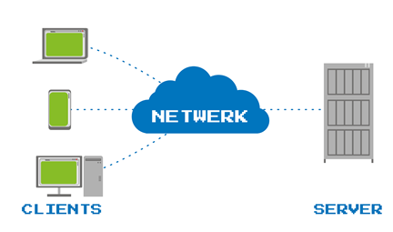
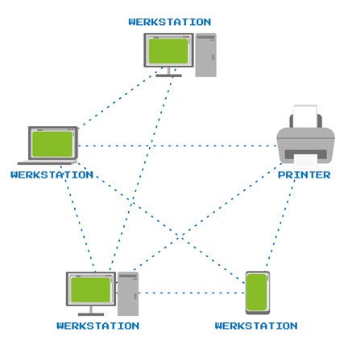
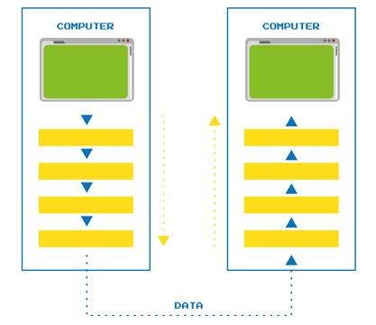
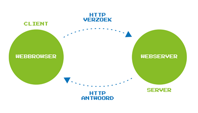

# Enkele inleidende begrippen op cloud computing en Internet of Things
## Computernetwerk
Een computernetwerk bestaat uit apparaten zoals laptops, desktops, smartphones, tablets, een router en een printer die met elkaar verbonden zijn en met elkaar kunnen communiceren. Er kunnen zelfs ‘slimme’ huis-, tuin- en keukenapparaten op dit computernetwerk aangesloten zijn. Zo’n netwerk kan bedraad of draadloos zijn, of een combinatie hiervan.

Een lokaal netwerk, een LAN (local area network), is een netwerk dat zich op een bepaalde plaats bevindt zoals in een gezinswoning, op kantoor of in een school. Een netwerk dat daarentegen apparaten verbindt die geografisch ver van elkaar staan, is een WAN (wide area network, zie Figuur 1). Het internet is een voorbeeld van een WAN: het internet bestaat immers uit allemaal netwerken verbonden met elkaar en het is wereldwijd.

->Figuur 1: Voorbeeld van een WAN dat drie LAN’s verbindt.<-

De apparaten in een LAN communiceren met elkaar via een router of switch. Als er data verzonden worden van één apparaat in het LAN naar een ander apparaat in het LAN, dan zorgt de router of switch ervoor dat die data terechtkomen bij de juiste bestemmeling. Een LAN is verbonden met het internet via een router en modem. Een WAN maakt meestal gebruik van het internet om de LAN’s met elkaar te verbinden.
Een toestel dat niet tot het LAN behoort, kan geen toegang krijgen tot de toestellen van het LAN en kan er ook niet mee communiceren. Daarom worden LAN’s bijvoorbeeld ook in luchthavens gebruikt om veiligheidsredenen, alhoewel de gebouwen op een luchthaven toch ook ver van elkaar kunnen staan. 

## De elementen van een computernetwerk   

De digitale apparaten in een computernetwerk worden de knopen of nodes van het netwerk genoemd. Een computernetwerk bevat ook verbindingen en heeft dus de structuur van een graaf.  

Een netwerk kan bv. bestaan uit een server en een aantal clients die de server nodig hebben om bepaalde taken uit te kunnen voeren. De server en de clients zijn dan de knopen^1. Men spreekt dan van een client-servernetwerk, zoals het voorbeeld in Figuur 2. Een server is dus een (meestal krachtige) computer binnen een netwerk, die beschikt over bronnen (bv. datasets) en software (bv. tekstverwerkingssoftware) die de apparaten in het netwerk, de clients, kunnen gebruiken. De clients zijn dus computers en andere digitale apparaten waarmee gebruikers toegang kunnen krijgen tot een server.

Figuur 2: Client-servernetwerk.

Elke client krijgt tot een bepaald niveau toegang tot de server. Daar kunnen privacy- en veiligheidsaspecten mee gemoeid zijn. Op een school kunnen bv. data van de leerlingen op de server worden opgeslagen, maar niet iedereen op de school mag toegang hebben tot die data. Er kan op die server ook software staan, bv. om aan tekstverwerking te doen, waartoe wel iedereen, zowel leerlingen als leerkrachten, toegang moet hebben.

In de praktijk zal een client een aanvraag sturen naar de server. De server verwerkt die aanvraag en stuurt vervolgens een antwoord naar de client. Als de client echter niet over de juiste machtigingen beschikt, dan zal de server het verzoek naar bv. data weigeren. 
Clients moeten niet altijd ingeschakeld zijn. Een server is normaal gezien wel altijd ingeschakeld, zodat een gebruiker op elk gewenst moment toegang heeft tot zijn bronnen en diensten.
Er zijn ook netwerken zonder server: peer-to-peernetwerken, zie Figuur 3. Al de computers in zo’n netwerk hebben soortgelijke mogelijkheden en dezelfde toegangsrechten. De peers delen bestanden, programma’s, rekenkracht en internetbandbreedte met elkaar.  Ze kunnen rechtstreeks met elkaar communiceren. Een peer-to-peernetwerk kan bijvoorbeeld geschikt zijn als LAN in een gezinswoning. 

Figuur 3: Client-servernetwerk.

## De gelaagde structuur van een computernetwerk  

Een protocol is een set regels die vastleggen hoe twee digitale apparaten met elkaar kunnen communiceren. Aangezien er veel verschillende soorten apparaten zijn, zijn er ook verschillende protocols nodig. Elk protocol is ontworpen voor een specifieke taak en de protocols moeten allemaal samenwerken om boodschappen over een computernetwerk te kunnen versturen.
In een netwerk zijn er meestal meerdere paden mogelijk van het ene apparaat naar het andere. Technologie zorgt ervoor dat het versturen van die data via het beste pad verloopt. Er moet bv. rekening gehouden worden met de omstandigheden op het moment van versturen, zoals een connectie die stuk is. Bovendien:
- Er gaan best geen cruciale data verloren (een e-mail mag niet deels aankomen, maar een stukje van een gestreamde game dat verloren gaat, kan soms wel toelaatbaar zijn).
- Sommige data moeten versleuteld worden. 
- Verschillende soorten data moeten verstuurd kunnen worden.
- ...

Voor al deze taken is er een ander protocol.

Stel dat er bepaalde data worden verzonden, dan gebeurt ruwweg het volgende:

- De data worden voorgesteld door bits, die naar een optisch, elektrisch of radiosignaal worden omgezet.
- Het signaal wordt verstuurd en komt aan bij de bestemmeling.
- Het signaal wordt opnieuw getransformeerd naar de oorspronkelijk verzonden data

Figuur 4: Een gelaagd model.

Dit proces omvat allerlei onderliggende processen en is georganiseerd als een aaneenschakeling van lagen. Laag na laag worden de data voorbereid vooraleer deze worden verstuurd, zoals te zien in figuur 4.

In de eerste laag worden bijvoorbeeld protocols gebruikt die opgemaakt zijn voor specifieke toepassingen, zoals het Hypertext Transfer Protocol (HTTP) en het Hypertext Transfer Protocol Secure (HTTPS) om een webbrowser te laten communiceren met een webserver. 

Maar er gebeurt nog veel meer in de volgende lagen:
- Vóór data, zoals bv. een foto, verstuurd worden, worden die data eerst opgebroken in pakketjes.
- Die pakketjes krijgen elk een nummer dat de volgorde van de pakketjes bepaalt. Er wordt soms ook nog foutenverbeteringscode toegevoegd (dat is dus extra data om eventueel verloren data te kunnen recupereren). Bij een pakketje wordt ook het type van de data opgenomen, zodat het terechtkomt bij de juiste toepassing. Is het bv. het antwoord op een verzoek aan een webserver, dan moet het antwoord terechtkomen bij de juiste toepassing, nl. de webbrowser. 
- Het IP-adres van de afzender en van de bestemmeling worden aan de pakketjes toegevoegd. 
- Pas na de onderste laag worden de pakketjes verstuurd, bv. over het internet. Afhankelijk van het type internetverbinding, zoals wifi of 4G, wordt een protocol geselecteerd en worden de data in het geschikte signaal omgezet, bv. een elektrisch signaal bij een bedrade LAN of een radiosignaal bij 4G, om vervolgens te versturen.

Elke laag krijgt de (voorbereide) data van de vorige laag en voegt er nog zaken aan toe. Aan de kant van de ontvanger worden alle stappen in omgekeerde volgorde terug tenietgedaan. 
Bij versleuteling moet er bovendien extra communicatie gebeuren tussen de encryptielaag bij de afzender, en de overeenkomstige laag bij de ontvanger, want daar moet de boodschap gedecodeerd kunnen worden. De overeenkomstige laag bij de ontvanger moet dus over de encryptiesleutel beschikken.   

## Het internet, cloud computing en het Internet of Things
### Het internet

Het internet bestaat uit allemaal netwerken verbonden met elkaar en is dus een wereldwijd WAN. Het internet geeft toegang tot het world wide web, waarop men allerhande informatie kan vinden via websites. 
Elke website heeft een unieke locatie op het internet, weergegeven door zijn ‘Internet Protocol’-adres, kortom IP-adres. IP-adressen bestaan uit een rij cijfers (meestal  vier getallen, elk opgeslagen in 8 bits ) en zijn niet zo gemakkelijk te onthouden, daarom gebruikt men domeinnamen zoals www.aiopschool.be (het IP-adres van de website van AI Op School is 157.193.244.98). De omzetting van de domeinnaam naar het IP-adres gebeurt via het internetprotocol Domain Name System (DNS). 
Als een domeinnaam wordt ingegeven in de webbrowser, dan zal de browser de DNS-server contacteren. Op deze server staat een database van de domeinnamen met hun overeenkomstig IP-adres. De browser zal de DNS-server vragen naar het IP-adres van de gewenste website, waarna hij de opgevraagde website zal tonen. DNS is een client-serversysteem.
De meeste diensten die aangeboden worden via het internet, zijn gebaseerd op een client-serverarchitectuur. De clientapplicaties sturen verzoeken naar de servers, die dan een antwoord sturen (zie figuur 5).  

Figuur 5: Communicatie tussen client en server.

Voorbeelden van client-servertoepassingen:
- Sommige smartphoneapplicaties maken een client van die smartphone. Ze verbinden de smartphone met een server, die dan zorgt voor de rekenkracht die ontbreekt op de smartphone zelf. Daardoor kunnen smartphones steeds meer taken vervullen.  De app Google Translate bijvoorbeeld maakt bij gebruik contact met een server, tenzij men ervoor koos om de software ook offline te kunnen gebruiken en de nodige software op de smartphone werd geïnstalleerd.
- Webdiensten en onlinegames maken ook gebruik van een client-servernetwerk. 

Men onderscheidt verschillende soorten servers: 
- webservers die webpagina’s bewaren en er toegang toe geven;
- e-mailservers die e-mail doorsturen naar de ontvanger en eventueel er ook de spam uit filteren;
- bestandsservers, die gebruikers voorzien van bestanden;
- databaseservers, die data bewaren en het mogelijk maken die data te bewerken. 

Verschillende servers kunnen op eenzelfde toestel tegelijk voorkomen.  

Door de opmars van het internet zijn er spontaan nieuwe zaken ontstaan, zoals socialemediaplatformen, onlineshoppen, gepersonaliseerde reclame; of aan de meer technische kant:  cloud computing en het Internet of Things. 

### Cloud computing 

Men kan ervoor kiezen om op een eigen toestel een bestand op te slaan of een applicatie te installeren en uit te voeren. Men kan ervoor kiezen dat te doen op de lokale server van een LAN. Men kan deze taken echter ook laten uitvoeren op een internetserver, dus door te kiezen voor cloud computing. Het voordeel is dat dat bestand of die applicatie dan in principe van overal toegankelijk is, zolang men beschikt over een apparaat waarmee men toegang heeft tot het internet.  Een internetserver is immers normaal gezien altijd ingeschakeld en verbonden met het internet, zodat een gebruiker op elk gewenst moment toegang heeft tot zijn bronnen en diensten. Voor de volledigheid dient vermeld te worden dat een bepaalde cloud misschien niet overal ter wereld toegankelijk is. In bepaalde delen van China bv. worden westerse servers geblokkeerd.
Merk op dat iets dat opgeslagen is in de cloud, nog steeds op één of meerdere fysieke apparaten is opgeslagen. 
Goed om te weten is dat er geen strikte definitie is van de cloud, omdat het begrip door velen op een andere manier wordt ingevuld. Het lijkt wel of de betekenis van de term mee evolueert met de grote evoluties in het domein. 
Client-servernetwerken en cloud computing winnen steeds meer aan belang. 
Er is natuurlijk een groot verschil tussen de hoeveelheid en de kracht van de servers die bv. Google gebruikt en de servers van een school of een middelgroot bedrijf. 
Bovendien kan men in principe een cloud server huren en gebruiken, zonder zelf te moeten investeren in een eigen fysieke server. Veel gebruikers hebben eigenlijk geen krachtige computer meer nodig. Meer en meer gebeurt de verwerking niet meer op het eigen toestel, maar op een server. Data worden steeds meer bewaard in de cloud (cloud storage), waardoor ook de behoefte aan lokale opslagmogelijkheden drastisch afneemt. (Het zijn vooral gamers en mensen die beelden verwerken die nog krachtige computers willen). 

Het kiezen voor een zogenaamde thin-client biedt voor- en nadelen:
- Voordelen voor de gebruiker: de aankoop van het apparaat is goedkoper, de gebruiker moet de software van de toepassingen niet zelf meer updaten, en vaak moet hij niet zelf meer zorgen voor een back-up van zijn data. 
- Nadelen voor de gebruiker: het apparaat moet steeds verbonden zijn met het internet, liefst met voldoende bandbreedte.

Cloudopslag of cloud storage is mogelijk gemaakt door het internet en wordt meestal georganiseerd door commerciële organisaties. Organisaties die in cloud storage voorzien, bv. Google op Google Drive, bieden dat vaak gratis aan voor een beperkte hoeveelheid data. Eens die hoeveelheid overschreden is, moet men betalen. Cloud storage kan zo geconfigureerd worden dat er een synchronisatie is met een lokaal toestel. Dan is er nog steeds een lokale kopie van die data, mocht er geen internettoegang zijn. 
Clouddiensten of cloud services zijn diensten die aangeboden worden via de cloud. Men kan daar op verschillende niveaus gebruik van maken. Men kan bijvoorbeeld een cloud server huren met een besturingssysteem, configuratie en software naar keuze om zelf die investering niet te moeten doen, het systeem niet zelf te moeten onderhouden of gemakkelijker te kunnen opschalen. Of men kan er bv. voor kiezen om gebruik te maken van bepaalde cloud software zoals e-mail, kantoorsoftware en software voor grafisch ontwerp. Men beschikt steeds over de laatste versie van de software zonder zich zorgen te moeten maken om updates. Door toepassingen te bundelen op een cloudplatform kan men bv. op een efficiënte manier rekenkracht tussen de toepassingen delen, en toegang verschaffen tot specifieke software.   

Voorbeelden van clouddiensten:

- Met de clouddiensten van Microsoft 365 kan men kantoortoepassingen zoals Word en Excel gebruiken zonder de software op het eigen apparaat te hebben geïnstalleerd. De aangemaakte bestanden worden dan opgeslagen in OneDrive en zijn daar steeds en vanop elk toestel bereikbaar. 
- Met Google Cloud Translation kan men bv. lange teksten of de chatgesprekken van een chatbot automatisch laten vertalen. 
- In Microsoft Word kan men via ‘Controleren > Vertalen’ ook automatisch laten vertalen. Er wordt dan een beroep gedaan op Microsoft Translator, vertaalsoftware in de cloud. 
- De notebooks van AI Op School en Dwengo vzw en de online Dwengo-simulator van de Dwenguino-programmeeromgeving.

Virtuele machines 

Om een cloud server te beschermen krijgen de gebruikers er vaak toegang toe via een virtuele machine (VM), als het ware een computer in een computer. Als er iets fout loopt in de virtuele machine, bv. de VM is gehackt of vastgelopen, dan kan men de betreffende VM uitschakelen, en worden de gedeelde diensten niet getroffen. 
Eenvoudig gezegd gaat een VM over software die elke combinatie van hardware kan nabootsen binnen een gastheer-systeem. De software die op de VM draait, werkt op net dezelfde manier als dat het met fysieke apparaten zou zijn. Een VM kan dus software runnen op dezelfde manier als een (fysieke) computer. Het gastheer-systeem kan een cloud server zijn, maar ook een laptop thuis of een computer op kantoor.

Enkele voorbeelden van hoe virtuele machines worden ingezet:

- Stel dat men software wil gebruiken die niet compatibel is met het OS van de computer, maar wel met een oudere versie van dat OS. Dan kan men met een VM de vroegere versie van het OS runnen en de software binnen de VM gebruiken.
- Met een VM kan men bijvoorbeeld Linux draaien op een Windows-computer. Het Linux OS wordt dan uitgevoerd binnen het Windows OS. 
- Omdat het VM-systeem geïsoleerd is van het gastheer-systeem, kan men een VM-systeem gebruiken om potentieel schadelijke software te testen, zonder het risico dat het gastheer-systeem beschadigd wordt.

### Internet of Things 

Het Internet of Things (IoT) bestaat uit een wereldwijd netwerk van fysieke toestellen, virtuele machines en mensen die voorzien zijn van elektronica, sensoren en software, en via het internet met elkaar zijn verbonden. Ze kunnen data verzamelen en met elkaar uitwisselen.

Via een apparaat geïntegreerd in het IoT wil men automatisch bepaalde metingen uitvoeren en interpreteren, en daarop afgaand geautomatiseerde aanpassingen doen in de omgeving van het apparaat, en die omgeving kunnen controleren.

IoT-apparaten worden steeds meer ingezet. Denk bijvoorbeeld aan het domoticasysteem dat vanop afstand met een smartphone wordt bediend en wearables om automatisch lichaamsparameters te meten. Hierdoor zal de hoeveelheid data ongekende proporties aannemen en zal ongetwijfeld de vraag naar cloud servers, cloud computing en cloud storage toenemen. De impact van het internet op de wereld is enorm. De opmars van de sociale media en het smartphonegebruik zorgen voor enorm grote hoeveelheden data. Deze digitale, meestal ongestructureerde data kunnen door AI-systemen met elkaar in verband worden gebracht (men spreekt dan van Big Data). 

Voorbeelden van IoT-toepassingen:

- Flitscamera’s zijn clients die foto’s nemen van nummerplaten en die dan via het internet doorsturen naar een server om op te slaan en te verwerken.  
- Het Internet of Toys waarbij speelgoed verbonden is met een cloud server. Zo kunnen bv. de conversaties van een kind met zijn ‘slimme’ knuffel in de cloud worden bewaard en eventueel worden gebruikt om spraakherkenningssoftware te verbeteren. Hierbij moet er echter over ethische aspecten nagedacht worden, niet in het minst privacy en het mogelijk beïnvloeden van kinderen.   
- Auto’s die automatisch een parkeerticket betalen.
- Nanobots in ons lichaam.
- Smart cities. 

## Voetnoten
1 Ook een router of een switch kan een knoop zijn in een netwerk.

## Bronnen

* [Isaac Computer Science. Network fundamentals.](https://isaaccomputerscience.org/topics/networking)
* [Isaac Computer Science. DNS and the cloud.](https://isaaccomputerscience.org/concepts/gcse_net_dns)
* [Isaac Computer Science. Secondary storage.](https://isaaccomputerscience.org/concepts/sys_hard_secondary_storage)
* [Isaac Computer Science. Virtual machines.](https://isaaccomputerscience.org/concepts/sys_os_virtual_machines)
* [Isaac Computer Science. Client-server technologies.](https://isaaccomputerscience.org/concepts/net_internet_client_server_model)
* [Craig’n’Dave. 22 juni 2017. OCR GCSE 1.4 Types of networks [Video].](https://www.youtube.com/watch?v=ZAMbMcYqK_0&list=PLCiOXwirraUCTooN8MYg4RDWF3FUC7JBU)
*[Craig’n’Dave. 19 januari 2020. AQA GCSE (8525) SLR2 Cloud storage [Video]. ](https://www.youtube.com/watch?v=b1tXebPtMGg&t=105s)
* Odun-Ayo, I., Okereke, C., & Evwieroghene, O. (2018). Cloud Computing and Internet of Things - Issues and Developments. 

